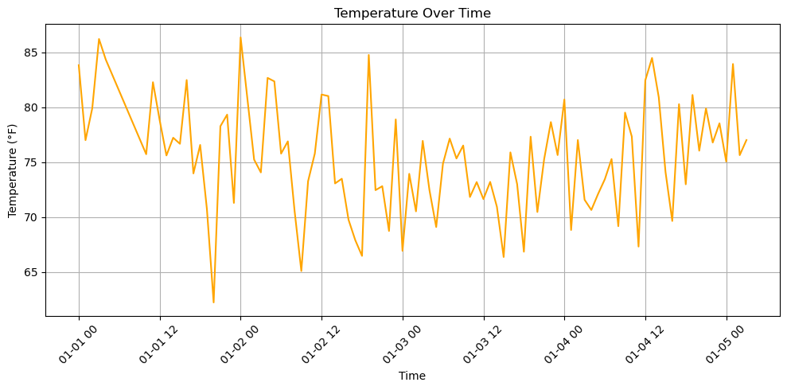

# IoT Sensor Data Curation and Visualization Project

This project was completed as part of the **Data Curation** course at the College of Computing and Informatics. The objective is to simulate a real-world scenario where data is collected from IoT sensors in a smart manufacturing system, cleaned, transformed, and visualized for decision-making.

## 👥 Team Members
- Huda Alamdi  
- Sara Almudlaj  
- **Raghad Aljuid** (Data Visualization Lead)  
- Ghala Almutairi  

## 🎯 Project Objective
To build a data curation pipeline that processes raw sensor data by:
- Cleaning missing and anomalous values
- Normalizing data for consistency
- Visualizing curated data for insight

## 🔧 Technologies Used
- Python (Anaconda & VS Code)
- Libraries: Pandas, NumPy, Scikit-learn, Matplotlib, Seaborn
- Version Control: Git + GitHub

## 📈 My Role (Raghad Aljuid)
As the **visualization and cleaning** lead, my tasks included:
- Creating a synthetic time-series dataset simulating temperature sensors
- Implementing linear interpolation for missing values
- Removing outliers using Z-score
- Applying Min-Max scaling for normalization
- Visualizing the cleaned temperature data over time using `matplotlib`

## 🧼 Data Curation Process
1. **Data Collection**: Synthetic generation of temperature data with noise
2. **Data Cleaning**:
   - Interpolation of missing values
   - Z-score outlier removal
3. **Transformation**:
   - Min-Max normalization
4. **Visualization**:
   - Line plot of temperature over time to assess trends and quality

## 📌 Sample Output
A snippet of curated and normalized data:
```
Time               Temperature   Temperature_Norm
0  2025-01-01 00:00:00    83.82             0.89
1  2025-01-01 01:00:00    77.00             0.61
2  2025-01-01 02:00:00    79.89             0.73
```



## 🔮 Future Scope
The curated dataset can be extended with machine learning models for:
- Predictive maintenance
- Real-time anomaly detection
- Smart factory automation

---

> **Note:** This work was submitted as a group project for academic purposes and follows the guidelines set in the course instructions.
